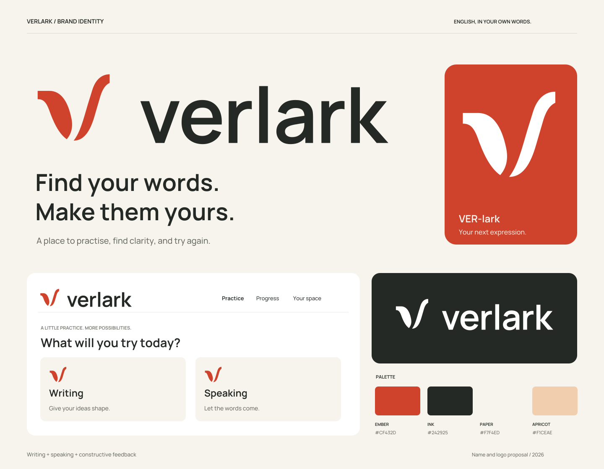

# Verlark

推荐的新英文品牌名为 **Verlark**，建议读作 **VER-lark**。这是受 verbal 与 lark 启发的造词，设计意图是“把想法练成自己的表达”，不是一个声称具有古语词源的词。项目名称、正文与 Logo 统一使用小写 verlark；不缩写为 Lark，不设未经确认的中文音译名。

定位：面向英语学习者，提供写作、口语练习和可执行反馈的练习空间。品牌语气沉稳、明确、鼓励尝试，避免幼儿化、考试焦虑和夸大的提分承诺。

建议描述：**English practice**。建议品牌文案：**Find your words. Make them yours.**



## 直接使用的文件

| 用途 | 文件 |
|---|---|
| 浅色背景主 Logo | [logo-primary.svg](exports/logo-primary.svg)、[透明 PNG](exports/logo-primary.png) |
| 单色 / 黑底反白 | [logo-black.svg](exports/logo-black.svg)、[logo-white.svg](exports/logo-white.svg) |
| 独立图形 | [mark-primary.svg](exports/mark-primary.svg)，另有 black / white 版本 |
| 仅字标 | [wordmark-primary.svg](exports/wordmark-primary.svg)，另有 black / white 版本 |
| 网页图标与头像基础 | [app-icon.svg](exports/app-icon.svg)、`app-icon-{16,32,64,256,1024}.png` |
| 可编辑图形源文件 | [mark.svg](source/mark.svg)，两条独立的闭合 Bézier 路径 |
| 可编辑字标 | [轮廓 SVG](source/wordmark-outline.svg)、[文本 SVG](source/wordmark-text.svg) |
| 展示与验收 | [品牌板](previews/brand-board.png)、[尺寸检查](previews/size-tests.png)、[横版缩小检查](previews/lockup-reduction.png) |

核心 SVG 是真实矢量，PNG 来自对应矢量文件。`logo-*` 与 `wordmark-*` PNG 宽 1600 px；独立标志和主图标 PNG 为 1024 × 1024。白色 Logo 的画布是透明的，在白色预览器中看不见属正常现象。

## 图形与字标

图形采用一短一长的开放曲面，形成不对称的 V。左边像一次起笔，右边向上展开；这是品牌解释，不要求用户第一次看到就解出隐喻。主要识别点是左右高度差、切平端口及底部开放间隙。不要把两部分合并、补细线或加叶脉。

字标基于 Manrope 650，逐字调整位置并转为轮廓；不是完全手绘字形。文本源嵌入同一份 Manrope 字体，供改字或重新排版时参考。生产使用优先选轮廓版，避免渲染器对嵌入字体支持不一致。

字体来自 [Google Fonts 官方仓库](https://github.com/google/fonts/tree/main/ofl/manrope)，许可证与原始字体位于 [fonts/](fonts/)。需要分发字体文件时，一并保留 OFL 和版权声明。界面标题可使用 Manrope 650，正文用 450；本次未替换实际项目字体。

## 颜色与背景

| 角色 | 色值 | 用法 |
|---|---|---|
| Ember | `#CF432D` | 标志、强调、大字与图标背景 |
| Ink | `#242925` | 字标、正文、深色背景 |
| Paper | `#F7F4ED` | 页面背景与图标前景 |
| Apricot | `#F1CEAE` | 辅助面色，配 Ink 文字 |
| White | `#FFFFFF` | 反白标志、纯白背景 |

Ink/Paper 对比度约 13.47:1；Ember/White 约 4.67:1；Ember/Paper 约 4.25:1。Ember 不用于 Paper 上的小号正文；品牌 Logo 本身与正文有不同用途。深色底用反白版，照片上先提供稳定底色，不直接叠在复杂纹理上。

## 留白、尺寸与图标

- 以图形左上平切端口厚度为单位 u（256 画布中为 24）。图形与周围内容至少留 1u；横版组合外围额外预留组合内图形高度的 1/8，避免依赖文件边缘的少量空白。
- 横版 Logo 建议至少 **176px 宽**，仅字标至少 **120px 宽**。16/32/64px 的小槽位使用独立图形或图标，不使用完整字标。
- 独立图形与图标检查了 **16、32、64、256、1024px**。16px 用于浏览器 favicon；重要品牌展示优先 32px 以上。
- app-icon 是不透明正方形。图形比例与位置单独适配，圆角交给具体平台；本次未制作 iOS / Android 商店完整资源包。
- 允许等比例缩放和使用本包配色；不要拉伸、旋转、描边、加阴影或渐变。不要单独把“lark”取出当产品名。

## 初筛与验证状态

公开名称初筛完成，未确认域名、社交账号或商标可用性。Verlark 的全名检索未定位到直接同类产品，但不能由此声称它全球唯一；单独的 Lark 已有软件品牌。具体查询、淘汰名称和原图比较见 [初筛记录](../identity/SCREENING.md)。

SVG / PNG 文件已渲染检查；字标文本版与轮廓版在浏览器中进行同尺寸比较。尺寸、图形边界、对比度及残余差异记录见 [verification.json](previews/verification.json)。没有进行真人记忆、听写或偏好测试。

完整设计决策见 [DECISIONS.md](../identity/DECISIONS.md)，imagegen 原始探索和提示词保留于 `../identity/`。实际应用代码与原有品牌尚未替换。

## 重新导出

生成工具不属于应用依赖。需要 Python 的 fontTools、Node 的 sharp；使用独立工具环境即可，无需更改项目 package.json。

```sh
python source/wordmark.py
node source/build.cjs
python source/presentation.py
```

`build.cjs` 生成生产 SVG / PNG 和黑白检查图。`presentation.py` 生成品牌板与尺寸检查 SVG；用 sharp 或矢量编辑器导出为 PNG。修改任何曲线、间距或字体后重新进行小尺寸与反白检查，不直接覆盖已验收版本而省略检查。
