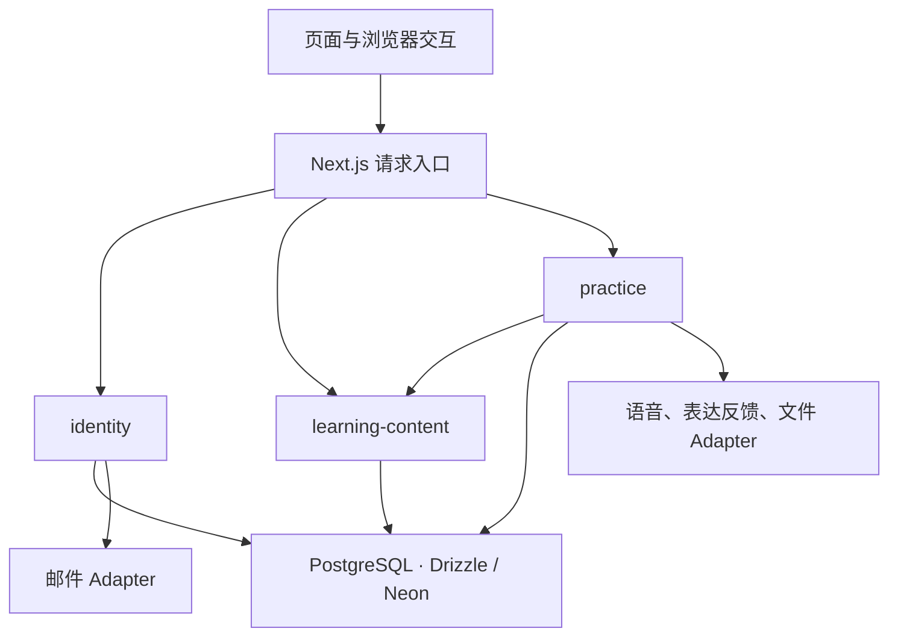

# Verlark 首版架构设计

更新日期：2026-10-08。状态：用户已确认采用本设计，作为后续实现基线；本轮仅更新文档，未查看或修改现有业务代码。产品和技术栈依据 [访谈记录](refactoring-design.md) 与 [ADR](adr/0004-next-drizzle-neon-better-auth.md)，业务规则依据 [领域模型](domain-model.md)。设计获确认不代表已经实现、通过部署验证或证明学习效果；具体字段、依赖版本及延后事项仍在实施时落实。

具体阶段与验收条件见 [重建执行计划](implementation-plan.md)。

业务关系、已确认规则与明确延后的事项集中见 [统一领域模型](domain-model.md)。

## 目标与范围

为用户本人和少量测试者提供一条 5–10 分钟左右的“先听后用”流程：选择日常短对话，聆听并按需查看帮助，录下自己的情况，核对转写，获得重点反馈，再次作答。提供邮箱认证、练习记录与手动重练。首版仅提供中文界面，适配手机与电脑浏览器，不做原生 App。

使用 Next.js、Drizzle、Neon、Better Auth，Vercel 优先。旧数据和模型不构成兼容约束；旧写作、独立 Coach、自由口语对话不进入首发。具体供应商、音频存储及其保留期限仍待决定，不以本设计代替这些决定。选型以已接受的 ADR 为准，README 中历史 Prisma 操作说明不作为新架构依据。

## 设计原则与依赖方向

保持单个应用，以三个业务 Module 为起点，把练习的一致性集中在 `practice`。Module 的 Interface 包括调用方式、权限、操作顺序、不变量、失败含义和重试规则；Seam 是调用方跨入这个 Interface 的位置。Implementation 隐藏数据库与外部处理细节，Adapter 在实际需要替换的位置满足约定。Depth 以调用方获得的 Leverage 衡量；Locality 表现在规则的修改与验证集中，而非目录层数增加。



图表示调用方向，不要求每个请求经过全部 Module。受保护入口先获取可信身份，再调用业务操作；`identity` 不依赖 `practice`，`learning-content` 不反向查询练习。业务 Module 不依赖页面或 Next.js 请求对象。外部 Adapter 不直接读写练习状态。

## 代码质量如何验收

- 修改反馈规则主要影响练习模块与反馈生成实现，不应同时重写页面、路由、数据库查询和多个全局类型目录。
- 页面和客户端无需了解数据库行、Better Auth 会话内部结构或供应商响应格式。
- 用户只能访问自己的练习和作答；权限规则在实际读取与变更入口执行，而不只依赖页面跳转。
- 可从空数据库执行版本化迁移，并运行关键业务验证。旧 QA 的缺陷证据可转化为适用的新断言，不要求保留旧功能或旧错误。
- 失败有明确状态与恢复动作，重复请求不能反复创建相同业务记录。
- 中文文案覆盖主要流程、验证错误、空状态与失败恢复提示；供应商错误和认证错误不能直接以原始英文信息暴露给用户。

目录层数、类数量、抽象接口数量和测试覆盖率数字本身不作为质量目标。

## 模块职责

| Module | 对外 Interface 的职责 | 内部 Implementation |
| --- | --- | --- |
| `identity`：身份与访问 | 确认当前身份、注册资格和账号访问资格 | Better Auth、邮箱认证、名单检查、密码恢复、邮件投递接入 |
| `learning-content`：学习内容 | 列出可用材料、读取历史版本、确定新练习可用版本 | 内容检查、发布与撤下、不可变文本、任务、释义、提示和音频引用 |
| `practice`：练习 | 开始与继续、提交作答、核对转写、请求反馈、重试、结束、历史、重练、删除 | 所有权、状态变更、版本一致性、幂等、Drizzle 查询、语音识别及反馈生成编排与恢复 |

上述模块是首版起点。语音识别、反馈生成和文件存取是外部能力，不另造与练习状态竞争的业务流程。它们的 Adapter 将供应商结果转为应用内部结果；生产与测试替身在实际外部调用处替换。用户已确定首批学习内容随项目维护和检查发布，不建设内容管理后台。

不为每张表创建通用 Repository 接口，也不要求所有函数都包一层仅转发的 Service。数据库查询放在所属模块内部；业务状态和错误使用业务定义，避免 Prisma/Drizzle 专属类型或错误码流入页面。

`identity` 判断身份与应用访问资格；`practice` 在每次受保护读取和变更时判断记录所有权与允许的操作。登录成功不能替代所有权检查。作答、转写、反馈、历史首版均属于 `practice` 的 Implementation，可按职责分文件，不各自建立独立业务 Module；它们共同维护同一次练习的一致性。

## practice 的公开 Interface

公开操作表达用户意图，不暴露任意更新状态或数据库行的操作，也不以接收任意 JSON 的通用 `execute` 隐藏真实约束。

| 操作 | 一次调用承担的完整责任 |
| --- | --- |
| 开始练习 | 选择材料当前最新可用版本，固定版本并创建所属练习 |
| 重练 | 校验原练习所有权、原版本可用性，创建新练习，不自动替换为新版 |
| 提交作答 | 校验录音引用、所有权和练习状态，处理重复提交，返回已接收作答 |
| 确认转写 | 检查并发修改与练习状态，保存新的确认文本版本 |
| 请求反馈 | 固定确认文本版本，编排生成、结果校验、保存和恢复 |
| 重试识别 | 重新处理原作答，不增加作答次数 |
| 结束练习 | 原子检查当前有效反馈与处理中请求，提交结束状态 |
| 读取详情与历史 | 校验所有权，返回可展示记录、真实处理状态与允许的动作 |
| 删除练习 | 校验所有权，禁止迟到结果写回，按最终存储规则处理关联文件 |

再次作答复用提交操作并使用新的提交标识；重新请求反馈仍引用原作答。相同提交标识的重发必须返回同一接收结果，不能再次创建作答；标识须限制在所属用户和练习的范围内，相同标识携带不同内容应返回冲突。提交结果不确定时，通过同一标识查询或重发核对接收结果。

读取结果可提供 `allowedActions` 和不可操作原因，帮助界面呈现；写入时必须重新判断，不能信任前端判断。公开错误表达未授权访问、练习已结束、版本冲突、内容不可用或处理失败等业务含义，具体编码实施时确定。页面不负责先检查再更新的两步业务编排。

## Next.js 的位置

采用以下目录职责，内部文件随复杂度增长再拆，不要求每个 Module 具有相同文件数量：

```text
src/
  app/                     页面、布局、请求映射、导航与缓存刷新
  modules/
    identity/
      server.ts            服务端公开入口
      contracts.ts         可公开的数据与错误含义
    learning-content/
      server.ts
      contracts.ts
    practice/
      server.ts
      contracts.ts
      ui/                  练习专属的浏览器交互
  integrations/
    speech/
    expression-feedback/
    files/
    mail/
  server/
    composition.ts         创建并注入数据库与外部 Adapter
    config.ts              服务端配置检查
  db/
    client.ts              数据库连接
    schema.ts              汇总各 Module 的表定义
  components/ui/           不带学习业务含义的通用视觉元素
content/                   随项目维护的材料源文件
drizzle/                   版本化 SQL 迁移
tests/e2e/                 少量跨 Module 的完整流程
```

模块内按需要拆文件，不强制每个模块有相同层级。Server Components 通过模块读取最少必要数据；Server Actions 和 Route Handlers 将请求映射为同一组业务操作。录音、播放、重录与提示展开由客户端负责。只有客户端确实需要的状态才放客户端状态管理，不再复制一份服务端练习状态作为平行事实来源。

跨 Module 的业务调用只使用公开 Interface，不导入对方的表或内部查询。业务表定义、查询、规则和行为测试放在所属 Module 内；`db/schema.ts` 仅为迁移工具汇总表定义，不承载业务规则。依赖装配和迁移汇总属于基础设施用途，不是供页面绕过 Interface 的入口。

`server.ts` 与 `contracts.ts` 是同一 Module 的公开表面在服务端和浏览器的组织方式，不是两个业务 Module。浏览器仅引用可序列化的数据契约，不使用混合导出入口带入服务端 Implementation。数据库及外部依赖在装配处创建并注入，业务操作不自行创建供应商客户端。

录音草稿、试听、播放位置、提示展开和未确认文本编辑属于浏览器临时状态；已接收作答、确认文本版本、反馈有效性及结束资格以持久记录为准。刷新后读取服务端记录恢复，未提交录音不承诺恢复。

Next.js 的 Cookie、重定向、缓存刷新、HTTP 与流式传输留在接入位置；学习规则避免依赖这些 API。所有受保护入口取得真实服务端身份，不能信任请求中自报的 userId。初始按 Node.js runtime 设计，不预设 Edge、常驻 WebSocket 或额外后台服务。

实施前需读取本地安装版本的 Next.js [数据安全指南](../node_modules/next/dist/docs/01-app/02-guides/data-security.md) 与 [服务端／客户端组件指南](../node_modules/next/dist/docs/01-app/01-getting-started/05-server-and-client-components.md)，并核对具体调用方式。本次仅确定架构职责，不宣称完成版本相容性核查。

## 界面与内容语言

用户最新决定为仅中文界面。登录注册、材料选择、练习操作、提示、历史和错误说明统一使用中文，英语听力原文、示例表达和学习者的英语作答保持英文。中文释义仍是可按需查看的学习辅助内容。

新架构不设置语言切换入口、用户界面语言偏好或多语言路由，不为未来可能的国际化预建抽象。现有语言解析、翻译 Provider 与多语言依赖在业务重建时核对调用后清理；本轮仅修改设计文档。

具体实现建议：业务模块返回稳定的错误含义，展示层映射为中文说明；页面语言标识与中文界面一致。文案可以按业务集中维护，无需同时维护一套英文界面字典。

新生成 AI 反馈的解释和建议统一使用中文，其中引用的英语原话与改进表达保持英文。不再按界面语言分支生成反馈，也不增加语言切换导致的反馈重生成逻辑。

## 数据关系与版本一致性

```text
Content
  └─ ContentVersion
       └─ Practice（属于一个用户）
            └─ Attempt
                 ├─ 原始转写
                 └─ ConfirmedTranscriptRevision
                      └─ ExpressionFeedback

Practice / Attempt
  └─ ProcessingRun（技术处理记录）
```

- 材料与表达任务是可复用内容，练习与作答是某个用户的实际学习记录。
- 开始练习时固定材料和任务版本；之后修改标题、提示或内容不能悄悄改变旧作答对应的任务。
- 一次作答对应一段主动提交并被系统接收的口头表达；再次作答不覆盖旧结果。试听后丢弃的未提交录音不计入作答。
- 原始转写与用户确认文本分别保存。反馈绑定确切的确认文本版本，防止文本改变后仍展示旧反馈。
- 反馈保留生成时的规则版本与必要溯源信息，便于解释历史结果；不把供应商完整响应当公共领域模型。
- 临时签名 URL 不作为永久录音身份。文件引用、访问与删除如何落实，需要音频存储决策完成后细化。
- 认证数据由 Better Auth 管理，学习记录关联用户身份；不再次实现一套密码和 JWT 系统。

这是关系设计，不是最终表结构。无需为首版创建通用课程树、任意练习插件体系或所有语言技能共用的大型 JSON 实体。

内容、确认文本、处理请求各有不同的版本与状态，不能用一个大状态字段代替：

- 发布内容不可原地改写，是否撤下作为独立的可用性信息维护。项目文件作为编辑来源，发布时写入持久化内容版本；历史读取不依赖当前部署包是否仍含源文件。不将文件存在等同于音频永久保留。
- 确认文本更正后产生新版本；当前有效反馈由反馈引用与作答当前确认版本的关系判断，不另存容易失真的 `hasFeedback` 作为事实来源。
- `ProcessingRun` 记录处理权、目标版本、期限、结果与失败等技术信息，不作为新的学习概念。具体字段与表划分在实现时确定。
- 练习区分未结束与已结束；不能用最后一次作答的状态推断整次练习状态。至少一次作答有当前有效反馈且无正在处理的请求才可主动结束。

## 领域边界核对

规范术语见 [词汇表](../GLOSSARY.md)。本文中的“反馈”均指表达反馈；材料中的短对话是供聆听的内容，不是学习者与 AI 的聊天记录。模块划分也不自动意味着需要多个领域上下文或多份词汇表。

已确认规则可用以下场景检查，后续实现应保持这些含义：

| 场景 | 领域含义与边界 |
| --- | --- |
| 用户展开对话文字，然后查看自己录音的识别结果 | 前者是材料原文，后者是作答转写，不能共用一个含义不明的“原文”标签 |
| 用户只听材料、查看提示，还没有开口 | 可以已有练习，但没有作答；播放次数不能当作作答次数 |
| 识别失败，用户让系统重新识别同一段录音 | 仍是同一作答的处理重试，不增加作答次数 |
| 用户根据建议重新录制并成功提交 | 是新的作答，原有作答和反馈保留；未提交录音不计入作答 |
| 用户把识别错误的词改回自己实际说出的词 | 是核对转写；把原本说错的句子润色正确不属于核对转写 |
| 反馈生成失败 | 作答仍然存在，尚无有效表达反馈；不能记录成能力低或得零分 |
| 材料发布新版，用户查看以前的练习 | 历史练习仍对应原内容版本，不能用新版任务解释旧作答 |
| 用户获得反馈后结束练习 | 表示本次学习过程结束，不表示掌握表达或通过能力测评 |

本次建模已由用户确认的细化：

1. **重练的记录边界**：已结束的练习不再追加作答；手动重练创建新的练习。未结束时重新表达属于再次作答。这样能保留每次学习过程的边界，历史中同一材料可以有多条练习记录。
2. **中途离开**：只听材料或尚未获得反馈便关闭网页，练习保留为未结束，下次可以继续或删除。关闭网页不算完成；获得有效反馈后才可以主动结束。未提交录音不计入作答，离开页面可能丢失，应明确提示。
3. **表达清楚时的反馈**：问题数量为零至两个；没有影响理解的问题时明确说明表达清楚，不为凑数强制纠错。可选提供另一种表达，但不能把风格偏好标成错误。这取代此前“一至两个”的数量下限。

另外已确认：未结束练习允许更正确认文本，旧反馈保留并标明原依据，新文本需重新请求反馈；已结束练习只读，可整次删除或重练。至少一次作答具有当前有效反馈且无正在处理的请求时可结束，其他作答可以保留失败或尚未核对的状态。详细边界见 [领域模型 P1–P3](domain-model.md)。

已确认的内容规则：从历史重练使用原内容版本，从材料目录开始使用最新版。原版撤下后保留历史，但不能用该版重练；明确提示用户可另选新版，不自动替换。发布新版不等同于撤下旧版。

本设计按文档中的业务含义建立，不从旧表或旧实现推导新模型。早期代码调查仅作为历史记录保留在访谈文档，本次未重新核实。

## 并发、幂等与恢复

核心路径为：录音提交 → 识别处理中 → 待核对转写 → 反馈处理中 → 可查看反馈。识别失败和反馈失败分别记录并提供对应重试，不把任何失败记为低能力或低分。

客户端重复发送同一提交时，用稳定提交标识和数据库约束识别同一作答。处理开始和结果保存分别用短事务完成，外部语音或模型调用不占用长事务。并发调用只有一个能取得有效处理权；结果写回校验处理版本，防止旧请求覆盖新结果。

统一处理顺序为：短事务检查所有权、状态和版本并登记处理权；事务外调用 Adapter；短事务再次检查处理权、目标版本和记录存续状态后保存结果。具体数据库锁定或条件更新方案实施时选择，并通过真实数据库并发测试验证。

结束练习与提交作答、发起处理须共享并发控制，避免两边同时检查通过。针对确认文本 V1 的反馈晚于 V2 返回时，不得成为 V2 的当前有效反馈；如保留该结果，只能注明原依据。删除或处理权失效后，迟到结果不得重新创建业务记录。

超时或进程终止后必须有恢复办法，不能永久停在处理中。恢复机制先按实际供应商响应和部署限制选择，不预先引入任务队列。数据库幂等不能保证外部供应商绝不重复收费：如果远端已接受请求但响应丢失，应记录不确定状态，并结合供应商幂等能力设计重试。

处理权需要期限，失效后经明确恢复操作转为可解释状态，并禁止旧请求继续写回。本地处理权失效不等于远端已经取消；重试前应区分明确失败与远端结果未知。恢复触发与执行方式留待实际运行环境验证，不能只登记任务却没有可靠执行路径。

界面区分识别文字、用户确认和生成反馈。输入为空、录音无可识别内容或供应商失败时，给出可操作说明，不生成伪造反馈。用户已确认：获得有效反馈后可以继续作答或主动结束练习；结束不意味着掌握表达。

用户已确认可以删除整次练习及其作答和反馈。删除需校验所有权，并避免仍在执行的识别或反馈请求将记录重新写回；关联音频的清理机制留到文件存储方案确定后补齐。部分删除或文件清理失败必须如实显示，不能宣称全部删除成功。

## 外部 Seam 与反馈质量

语音、表达反馈、文件和邮件使用内部 Seam：生产 Adapter 和明确的测试 Adapter 均有实际用途。它们的契约由使用方所需能力决定，不复制供应商完整协议。测试可在装配时替换 Adapter，普通业务调用方无需了解替换细节。

数据库直接使用 Drizzle，并用真实、隔离的 PostgreSQL 测试约束与事务，不为假想的更换 ORM 建立通用 Repository。纯规则直接返回结果，不依赖网络、页面状态或供应商客户端。

表达反馈 Adapter 将响应转换成约定结构；`practice` 决定所用内容与确认文本版本、校验结果、记录规则版本并接受或拒绝结果。中文解释、零至两个问题、英文引用和改进表达、不得评价发音等要求既需结构校验，也需质量样例检查；提示词或结构合法本身不能证明反馈准确。空文本、无可识别内容和供应商失败不能产生伪造反馈。

## 验证与实施顺序

1. **保存现状与建立新骨架**：确认已有未提交修改的保存方式；不恢复已删除 Prisma 文件，不清空现有目录。锁定稳定且相容的依赖，建立类型、格式、lint 和测试入口。
2. **认证与新数据库**：空库迁移，测试名单注册、邮箱验证、登录、恢复密码、退出和会话撤销。验证跨账号读取和写入均被拒绝。
3. **一份材料跑通真实业务流程**：用测试替身完成练习、作答、转写确认、反馈、重录和历史展示；先证明状态与所有权正确。替身结果必须在开发环境中明确标识。
4. **接入真实能力并验证部署**：确定并接入文件、语音、反馈及邮件服务，验证录音上传、浏览器格式、实际识别、Vercel 运行限制和两类地区的访问。真实能力尚未接通时不能宣称首版可用。
5. **扩充首批内容与试用**：审核文本和音频、检查任务能引导表达自身情况，通过实际试用调整难度；最后清理已确认废弃的旧代码和依赖。

重点验证包括：跨账号隔离、撤销会话、重复提交、识别失败、反馈失败、并发重试、修改确认文本后的反馈一致性、材料更新不改变历史，以及从空库重建。无需为纯转发函数逐个创建镜像测试。

测试通过与调用方相同的 Module Interface 断言可观察行为，不以内部调用次数或文件划分为目标。业务验证使用真实测试数据库与外部 Adapter 替身，并至少覆盖：

- 重发同一提交只产生一次作答；识别重试不增加作答次数。
- 唯一反馈对应旧确认文本时不能结束；一次作答有效、另一次失败时符合条件仍能结束。
- 并发结束与提交不能破坏只读规则；超时恢复后旧处理权不能写回。
- 删除后迟到结果不能恢复记录；跨账号读写均被拒绝。
- 内容发布新版不改写历史；撤下旧版阻止原版重练；部署包不再包含旧源文件时仍可读取已持久化历史内容。

浏览器流程验证与真实供应商验证分别报告；内部重构不应迫使行为测试随之改写。

必须至少完成手机和电脑浏览器的真实麦克风录音、识别、反馈与重练，并验证中文主要流程和错误提示；模拟测试不能证明语音质量或学习效果。具体浏览器版本矩阵在实施验收中确定。

## 明确延后的接入决策

| 分支 | 当前状态 | 影响 |
| --- | --- | --- |
| 音频存储及保留、删除规则 | 用户明确暂缓选择 | 上传、历史回放、数据删除不能最终定案 |
| 识别、反馈、材料音频与邮件供应商 | 用户同意真实接入前集中比较确定 | 真实验收与运行费用 |
| 月度预算与实际部署地区 | 用户同意接入前依报价确定预算与上限；要求大陆和海外可用 | 服务选择与上线验证 |

供应商、费用和音频存储已由用户明确允许延后，不虚构具体选择或预算。产品、核心规则与本架构设计已确认，下一实施阶段为新骨架、数据与身份；本次按用户要求保持文档工作范围。真实接入和首版可用的验收仍需完成被延后的决策与验证。
