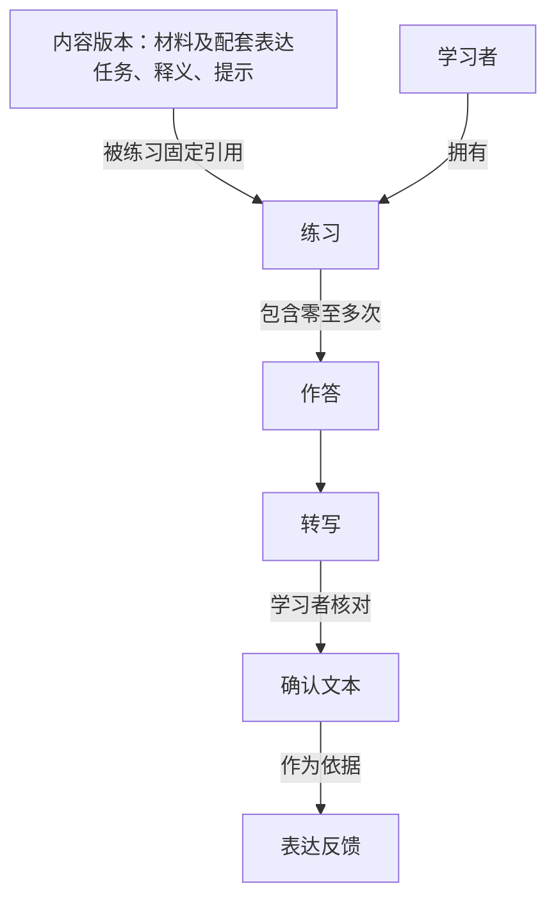

# Verlark 首版领域模型

更新日期：2026-10-07。状态：首版核心规则已逐项确认，形成领域模型基线。本文集中记录业务关系与规则；术语定义以 [GLOSSARY](../GLOSSARY.md) 为准，实现安排见 [架构方案](architecture-proposal.md)。设计共识不代表业务代码已实现或学习效果已验证。

## 模型范围

首版承载“先听后用”：学习者听网站提供的英语短对话，再围绕表达任务说出自己的情况，核对转写并获得表达反馈。网站界面和反馈说明为中文，英语材料、示例和英语作答保持英文。

材料与任务描述可反复使用的学习内容；练习与作答描述某位学习者实际发生的学习经历。认证决定谁可以进入和访问记录，不定义学习是否完成。首版无需把课程、等级、积分、掌握程度或自动复习计划引入模型。

## 核心关系

转写、确认文本和反馈是逐步产生的；图中的箭头不表示每次作答立即拥有所有结果。未开口的练习没有作答，识别失败的作答没有可供确认的识别结果，反馈生成失败不产生有效反馈。

已确认：练习固定所用内容版本；材料更新不改变旧练习。一个练习中的多次作答属于同一学习过程；重练开启另一练习，保留原练习供对照。

## 已确认规则

| 边界 | 统一规则 |
| --- | --- |
| 练习与作答 | 一次练习可以有多次作答；播放材料、查看提示不算作答 |
| 再次作答与重试 | 再次口头表达与重新处理同一份录音不同；识别重试、反馈重试不增加作答次数 |
| 材料原文与转写 | 材料原文呈现听力内容；转写呈现学习者的口头表达 |
| 核对与改进 | 核对只纠正识别错误；改进实际说法需要再次作答 |
| 反馈依据 | 表达反馈依据确认文本；不能据此评价发音、语调、停顿 |
| 反馈数量 | 零至两个影响理解的问题；表达清楚时可以没有纠错项，替代表达不自动意味着原话错误 |
| 离开与结束 | 中途离开保留未结束练习，可以继续或删除；关闭网页不算完成 |
| 结束与掌握 | 获得有效反馈后可以主动结束；结束不等于掌握表达 |
| 重练 | 创建新练习；已结束练习不再追加作答 |
| 版本选择 | 从历史重练使用原内容版本，从材料目录开始使用最新版；原版撤下后保留历史、禁止用该版重练，不自动替换成新版 |
| 删除 | 可删除整次练习及其作答和反馈；录音清理规则随存储方案确定 |

“有效反馈”在这里指针对所确认文本成功得到的表达反馈，不代表评分及格，也不要求一定有纠错项。生成失败不是有效反馈。

## 已确认的作答与结束边界

以下三条已由用户明确确认，编号保留供场景引用。

### P1：正式作答从提交被接收开始

允许录音后试听、丢弃和重录，未提交的录音不进入作答历史。用户主动提交且系统成功接收后形成正式作答；后续识别失败仍保留这次作答。

这使历史记录代表用户选择提交的表达，代价是未提交录音可能随离开页面丢失，必须明确提示。“保留未结束练习”不承诺保留所有浏览器内的录音草稿。提交结果不确定时先核对是否已接收，不能重复产生作答。

### P2：更正产生新的确认文本，旧反馈仍对应旧文本

未结束练习允许再次纠正识别错误；更正后需重新确认、重新请求表达反馈。旧反馈保留并标明原依据，不覆盖为新文本的反馈，也不增加作答次数。

已结束练习只读，仍可整次删除或重练。这样历史稳定，但结束后发现识别错误不能直接修订旧记录。这条只读规则已获本次明确确认。

### P3：至少一份当前有效反馈即可结束，不要求所有作答成功

至少一次作答具有对应其当前确认文本的有效反馈，且没有正在处理的请求时，可以结束练习。其余作答可保留失败或尚未核对的状态，不能显示为全部完成。

由反馈绑定当前文本的规则可推得：若唯一反馈对应的是更正前的旧文本，需针对新确认文本得到反馈后再结束。请求卡住时必须能恢复到明确状态，不能无限阻止用户结束；具体恢复办法属于实现设计。

## 用同一个故事检查模型

下面采用已确认的 P1–P3 演练，检查规则在同一次学习过程中的一致性。

| 用户经历 | 记录如何解释 |
| --- | --- |
| 今天开始“周末计划”，听了一遍 | 练习甲，零次作答 |
| 录了一段，试听后丢弃 | 仍为零次正式作答（P1） |
| 重新录音并成功提交 | 练习甲的作答一（P1） |
| 转写把原话识别错了，用户纠正并确认 | 仍为作答一，确认文本还原原话 |
| 获得反馈，表达清楚，没有纠错项 | 已有有效表达反馈，不必强制挑错 |
| 用户再次表达并提交，识别失败 | 作答二保留，失败不影响作答一 |
| 没有处理中的请求，用户主动结束 | 练习甲结束，作答二仍为识别失败（P3） |
| 明天点击重练 | 创建练习乙，不向练习甲追加作答 |

另一条分支：如果用户在结束前发现作答一的确认文本仍有识别错误，则更正后，原反馈只作为旧文本的历史反馈（P2）；若没有其他当前有效反馈，需要取得新反馈才能结束（P3）。

## 内容关系与版本边界

沿用此前已确定的首版范围：每篇短对话配套表达自身情况的任务，材料、音频、任务、释义和提示一起检查发布。一份练习固定所用内容版本，不在中途换成另一个任务；首版不引入任务任意搭配或课程编排体系。

用户已确认以下版本选择规则：

| 入口或变化 | 结果 |
| --- | --- |
| 从材料目录开始练习 | 使用该材料当前发布的最新可用版本 |
| 从历史记录重练 | 用原内容版本创建新练习，便于对照 |
| 发布新版 | 不改写历史练习、原任务及其作答依据 |
| 原版本撤下 | 保留历史，不能再用该版本重练；明确提示，可另选新版开始新练习 |

“发布新版”与“撤下旧版”不是同一件事；新版存在不自动使原版不能重练。内容是否可重练与历史是否保留也分别判断。因文件保留规则造成的历史音频可用性，仍需在存储决策中明确，不能将“保留历史”解释为已承诺永久保存所有音频。

## 明确延后的事项

语音、邮件、文件服务、录音保留和清理规则、费用与部署地区已允许推迟到真实接入阶段。本模型不虚构这些选择，也不把数据库表、供应商协议和技术处理状态当作新的学习概念。

目前不为这些可调整的规则另建 ADR。已有重建范围与技术选型决定继续保留在 [ADR 目录](adr/0001-rebuild-domain-without-legacy-data-compatibility.md)。
