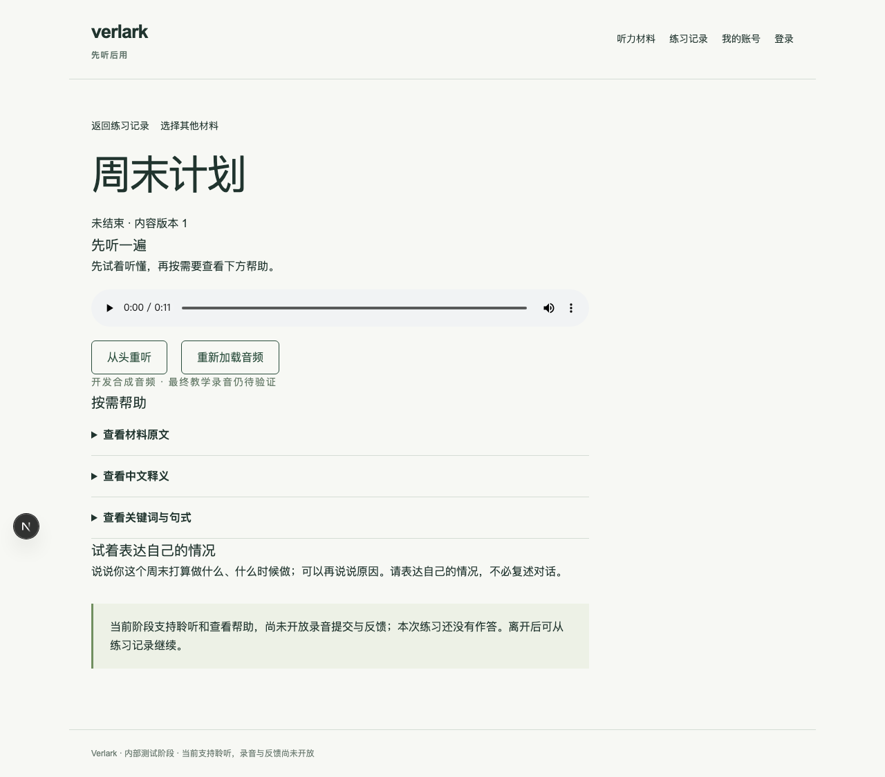
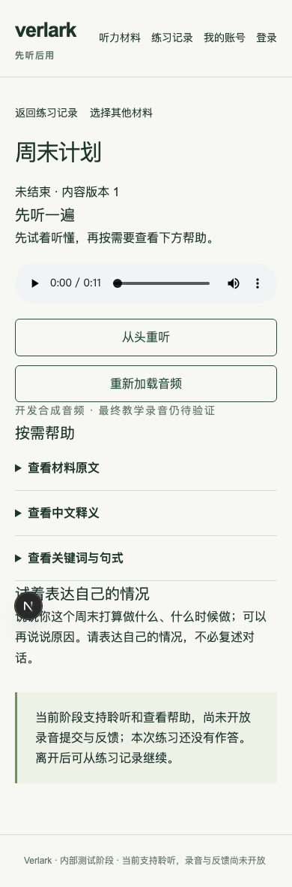

# #7：材料选择与持续聆听练习

日期：2026-10-09。基线：`2442bb9`（基础 PR #25 已合并，#2–#6 已关闭）。UI 定稿由用户明确后置；保留现有简单中文样式，原型与品牌资料在独立远程分支 `prototype/listen-then-use-ui`。

## 交付行为

- 项目维护一份“周末计划”短对话；发布命令检查开发音频存在，并持久化完整文字、表达任务、释义、关键词、句式、示例和稳定音频路径。同一材料/版本不允许改写。
- 目录使用最新可用版本；练习固定版本及真实学习者身份。刷新、关闭和历史继续不会结束或创建替代练习。播放器位置和帮助展开状态属于临时状态。
- 原文、释义默认隐藏，完整示例须在关键词/句式后主动展开。未接通录音/反馈，聆听及帮助不创建作答。
- 所有详情/历史查询按所属学习者过滤，HTTP 入口取得真实会话，拒绝客户端用户标识及不可信来源。
- 开始操作使用学习者范围内的稳定请求标识；重复/并发请求返回原记录，换材料返回冲突。用户明确开始另一练习时使用新的请求标识。

## 验收与实际证据

使用本次新建的 PostgreSQL 17 隔离容器（仅本机 55441），模块测试库与浏览器测试库分开；未对应用或云端数据库执行迁移、发布或清理。

| 检查 | 结果 |
| --- | --- |
| 类型 / lint / 格式 | 通过 |
| 默认 Turbopack 生产构建 | 通过 |
| 全部模块测试 | 4 文件、15 项通过；无跳过 |
| 迁移 | 两个随机空库执行完整迁移、重复执行、持久化读写、重建通过 |
| C01 / U01 | 桌面 1280×800 与手机视口 390×844：选材、音频加载/播放、重听、原文/释义/逐级帮助通过 |
| C04 / 版本固定 | 发布后删除临时内容源文件，重新创建模块仍可读取原文字/任务/释义/提示；新版不改变旧练习 |
| P01 / P08（本票范围） | 聆听/帮助不产生作答；刷新、关闭标签页再从历史进入仍是同一记录 |
| A04 | 匿名拒绝，跨账号 API 404/页面无记录，伪造 userId 被拒绝，另一账号列表为空 |
| 重发恢复 | 真实 PostgreSQL 五路并发只创建一条；浏览器模拟服务端接收成功但响应丢失，重试后仍只有一条记录 |
| 认证回归 | 桌面、手机视口既有认证流程各 1 项通过 |

浏览器聆听两条用例修复后定向复测通过，认证两条用例在同轮完整运行中通过。日志在本机 `/tmp/verlark-issue7-final-{e2e,listening,build}.log`。这不是实机录音、部署地区、真实服务或学习效果验收。音频使用 Samantha 合成开发素材，实际学习难度和教学听辨质量留待真实材料阶段。

## 审查及修复

Standards 初次发现 1 项：开始操作缺少服务端重复请求保护。先以测试复现五路重发产生五条记录，再加入请求标识和数据库唯一约束；复核 0 项剩余。Spec 初次审查 0 项缺失。

浏览器曾复现跨账号拒绝错误被映射为 503：共享服务抛出的错误与不同 Next 路由包内构造器不相同，`instanceof` 不能作为唯一分类依据；已改为稳定错误名称/代码并验证 404。另修正测试等待页面加载和正文 alert 定位，避免截图落在加载页或与 Next 路由播报元素重名。所有失败均在修复后复测，未作为通过记录。

## 界面证据

## 使用与后续边界

目标开发环境依次运行 `pnpm db:migrate`、`pnpm content:publish`、`pnpm dev`，登录后进入 `/materials`。本次仅在隔离测试库运行前两项，未自动修改用户配置指向的数据库。

录音提交 #8、转写 #9、表达反馈 #10 及结束、删除、重练等后续票据仍未交付。开发音频暂随部署包保存，真实文件存储、保留和清理规则依旧延后。
