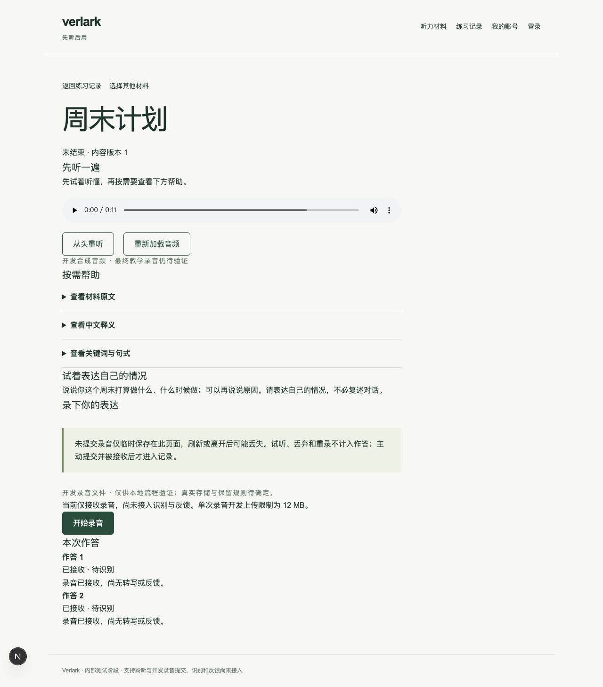
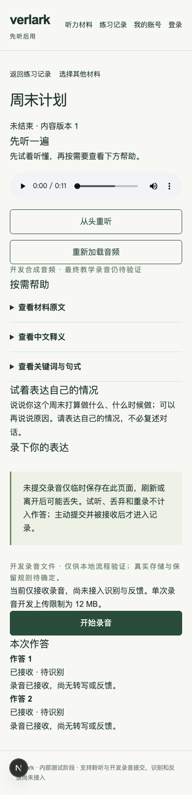

# #8：录音、试听并幂等提交正式作答

日期：2026-10-10。基线：`87dde01`（#7 已经 PR #26 合并）。交付分支：`integration/issue-8-recording`；[PR #27](https://github.com/Frost-96/verlark/pull/27) 关联并在合并后关闭 #8。范围仅为 #8，识别、确认文本、反馈、结束与删除由后续票据交付。UI 定稿继续后置。

## 交付行为

- 浏览器实际使用 MediaRecorder 采集录音，协商支持的音频类型；支持停止、试听、丢弃和重录，中文提示权限拒绝、采集失败及空录音。关闭、丢弃和失败时释放麦克风与试听资源。
- 录音草稿只保存在页面内存，上传文件本身不创建作答。页面持续提示刷新或离开可能丢失草稿，并为刷新、关闭与站内链接提供离开提醒。
- 通过 `practice` 公开接口保存录音、接收提交和查询结果。HTTP 入口使用真实会话及同源检查；接收操作重新检查所有权、练习状态和文件引用归属，不接受客户端指定身份。
- 显式开启的开发文件 Adapter 使用私有本机目录、原子写入和服务端摘要；相同用户、练习、类型及内容得到稳定引用。配置与 Adapter 均禁止正式环境启用开发模式。
- 迁移 0004 增加作答表、练习外键及 `(practice_id, submission_id)` 唯一约束。接收使用练习行锁，重复或并发提交返回同一作答，同标识换内容返回冲突。已接收提交的重发不依赖文件服务仍在线。
- 正式作答从数据库恢复并显示“已接收 · 待识别”，不生成虚构转写或反馈。结果不确定时按提交 ID 分别保存标识与引用，重新进入后逐个查询或重发原请求；多标签页互不覆盖待核对记录，过期的初始化查询不再影响新录音。音频草稿不写入浏览器持久存储。

## 已执行验收

全部数据库操作使用本次新建的本机 PostgreSQL 17 容器，监听 127.0.0.1:55442；模块与浏览器测试使用不同数据库。没有对既有本机应用库或远端数据库迁移、清空或发布内容。

| 检查                          | 实际结果                                                                                                             |
| ----------------------------- | -------------------------------------------------------------------------------------------------------------------- |
| 锁定依赖离线安装              | 通过                                                                                                                 |
| 类型 / lint / 格式 / 生产构建 | 通过                                                                                                                 |
| 模块及公开 HTTP 行为          | 5 文件、22 项通过，无跳过                                                                                            |
| 最终浏览器回归                | 桌面 1280×800、手机视口 390×844：认证、聆听、录音、多标签页恢复、StrictMode 迟到查询各 1 项，共 10 项通过            |
| 空库迁移 / 重建               | 两个随机空库执行完整迁移、重复迁移、持久化读写与重建均通过；仅清理本次创建的验证库                                   |
| P01                           | 试听、丢弃、重录与文件上传不创建作答；主动提交被接收后才创建                                                         |
| P02                           | 真实 PostgreSQL 并发同标识只产生一条；不同内容冲突；上传或接收响应丢失后使用同标识恢复                               |
| P08                           | 已接收结果刷新后恢复；尚未查到结果时保留原标识重发，不直接创建新的作答                                               |
| A04                           | 匿名、伪造身份、跨账号、其他练习及不存在的录音引用被拒绝；已结束练习拒绝新提交                                       |
| U01 / U02 开发行为            | 中文录音操作、权限拒绝、采集失败、试听、重录和离开提示；真实 Chromium MediaRecorder 配合浏览器虚拟麦克风，无横向溢出 |
| R01                           | 开发模式明确标识；正式环境配置与 Adapter 双重拒绝开发文件模式                                                        |

关键修正均先复现再修复：取消授权后的迟到失败曾误停新录音；已接收提交在文件服务故障时曾不能重发。相应浏览器与公开接口回归通过。

## Standards

初审 1 项 P2：同一练习的多标签页共享一条待核对记录，互相覆盖或误删其他标签页的提交标识。改为每个提交 ID 独立存储，逐一核对所有待确认提交，只清理对应 ID。双标签页回归先在旧实现复现失败，再在修复后通过。独立复核：0 项剩余问题，未发现新的可操作问题。

## Spec

初审 1 项 P2：React StrictMode 重放恢复 effect 后，迟到的旧查询会清除新录音草稿，隔离 Chromium 复现播放器从 1 个变为 0 个。使用 effect 局部取消标记与 AbortController，查询只返回数据，初始化完成前禁用新录音与手动恢复；接收回调仅清除同 ID 的草稿。基于实际组件的浏览器回归先失败后通过。独立复核：0 项剩余问题，未发现新的可操作规格缺陷。

修复提交为 `d6d58b6`；修复后重新执行完整 22 项模块测试、10 项浏览器测试和类型、lint、格式、生产构建，均通过。两轴复核为代码审阅，未重复运行已通过的检查。

## 未执行与边界

- 未验证真实手机、物理麦克风、Safari、Android、Vercel / Neon 网络与大陆或海外部署。浏览器虚拟麦克风和手机视口不等于完整 U02 真机验收。
- 未接入真实文件、邮件、识别或反馈服务，没有决定生产存储、保留期限、删除规则、预算或部署地区。
- 12 MB 是明确标注的开发上传上限，不代表最终产品限制或部署平台能力。已接收录音尚无公开下载入口，试听来自当前浏览器草稿。
- 已结束状态测试仅将结束状态作为数据库夹具，再通过公开接口断言拒绝提交；结束操作尚属后续任务，不能将此视为结束与提交并发的完整验收。
- 构建、测试及合法状态不能证明识别质量、反馈质量或学习效果。

## 界面证据

## 本机使用

按 README 配置新的开发数据库并执行 `pnpm db:migrate`、`pnpm content:publish`，显式设置 `DEVELOPMENT_RECORDINGS=true` 后启动开发服务器。名单用户登录后从材料进入练习。文件写入私有 `.dev-recordings/`；未配置真实文件服务时正式环境不会回退到开发存储。本次未修改用户现有环境配置。
