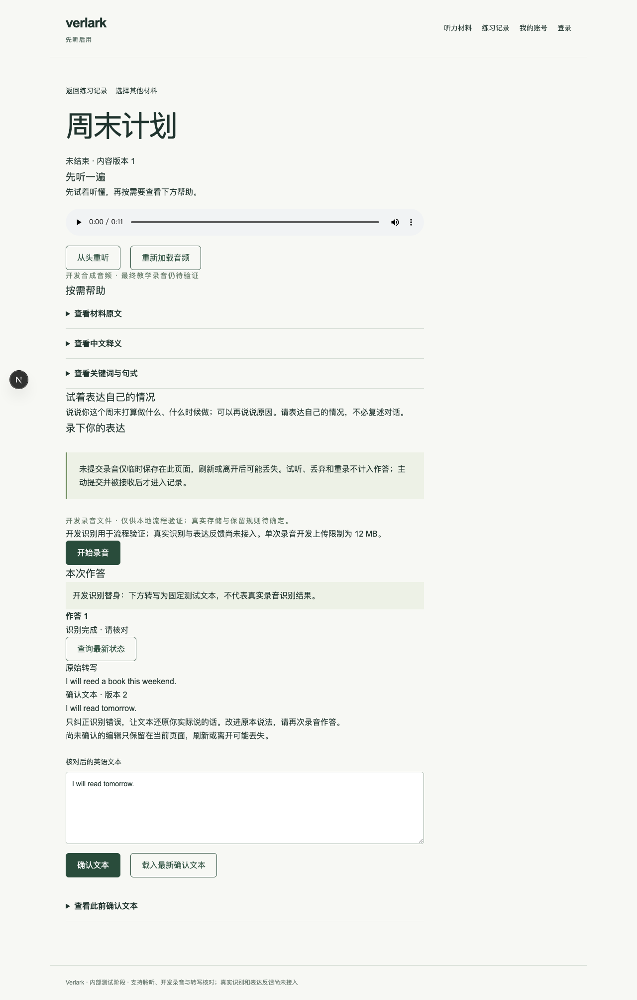
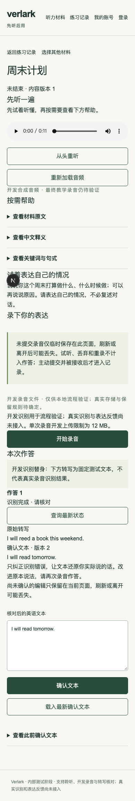

# #9：识别、核对与确认文本

日期：2026-10-10。基线：`316bda8`。票据分支：`ticket/issue-9-transcription`，集成分支：`integrate/issue-9-transcription`。范围为 #9；真实识别服务、表达反馈、结束和删除操作属于后续票据。本记录不代表首版完成或真实识别质量验收。

## 交付行为

- 显式开启 `DEVELOPMENT_TRANSCRIPTION=true` 后，开发/测试环境可以识别已接收录音。页面注明固定测试转写，配置和 Adapter 均拒绝正式环境启用；未配置时明确不可用，不回退为固定结果。
- 识别读取已接收作答的稳定文件引用，验证私有原录音的归属和摘要后将字节、类型及元数据交给外部 Adapter。文件不可用、供应商明确失败、无可识别内容、非法响应和远端结果未知分别保留真实说明，不伪造转写。
- 原始转写保存在作答的独立字段，确认文本保存在 `confirmed_transcript` 版本表。确认需匹配原始转写 ID 及最新确认版本 ID；并发修改只接受一份版本，旧版本保留。核对、更正和重试均不新增作答。
- 识别先以练习行锁检查所有权与状态，短事务登记 60 秒处理权；文件读取和识别位于事务外；短事务再次检查练习存续、状态、处理权及期限后写回。过期请求即使尚未恢复也不能写回，恢复后的旧请求不能覆盖新结果。
- 页面“查询最新状态”读取持久状态。“恢复超时处理”实际将过期处理转为“结果未知”，用户可继续“重试原录音识别”。本地失效不表示远端取消。页面重新进入及实际进程终止后均可执行这条恢复路径，无需原请求仍存活。
- 中文核对界面分别显示原始转写、当前及历史确认文本，提示只纠正识别错误、改善说法需再次录音。冲突与网络失败保留当前编辑；查询不会静默将编辑改为新版本，用户可主动载入最新文本。请求未完成时禁止继续编辑，旧响应不能覆盖新请求状态。
- HTTP 入口只使用实际认证会话，拒绝跨站写入与客户端伪造身份；模块入口重新检查所有权、练习和作答关系。请求体与转写长度有界，返回私有且不缓存的响应。
- 迁移 0005 为已有作答补充技术处理状态和原始转写字段，新增确认文本版本及外键、唯一约束。生成器最初把被引用唯一约束放在外键后，已在实际 PostgreSQL 迁移失败后修正顺序；完整空库迁移已执行通过。

## 测试边界与红绿证据

沿用首版规格已经确认的边界：调用方使用的 `practice` 公开 API + 真实隔离 PostgreSQL，在文件/识别外部能力及时间边界使用替身；少量浏览器流程验证真实会话、HTTP 和界面。不检查内部调用次数。

逐片实施的失败证据：首条持久转写/确认用例因缺少 `recognize` 失败；过期恢复用例因缺少 `recoverRecognition` 失败；原录音字节验证在 Adapter 尚未取得原文件时失败；替身环境保护在 Adapter 尚不存在时失败；浏览器流程因缺少“识别本次录音”按钮失败。各片实施后对应测试通过。延迟确认的浏览器用例在移除编辑保护后明确得到“预期 disabled、实际 enabled”，恢复保护后通过。

并发测试通过公开读取断言同一次作答的最终文本和版本；真正启动独立 Node 识别进程，等待它登记处理权并进入故障 Adapter 后发送 SIGKILL，再用新实例/重新进入页面恢复。时间在测试外部边界控制，不实际等待一分钟；不能把该测试说成生产平台或远端取消验证。

## 已执行验收

只使用本次新建的 PostgreSQL 17 容器 `verlark-issue9-postgres`，监听本机 `127.0.0.1:55449`。模块库为 `verlark_issue9_test`，浏览器库为 `verlark_issue9_e2e_test`；空库验证额外创建随机测试库并只清理这些验证库。未访问、迁移或清空用户现有应用数据库及远端资源。

| 检查                          | 实际结果                                                                                                         |
| ----------------------------- | ---------------------------------------------------------------------------------------------------------------- |
| 锁定依赖离线安装              | 通过                                                                                                             |
| 类型 / lint / 格式 / 生产构建 | 通过；lint 无警告                                                                                                |
| 模块及公开 HTTP 行为          | 7 文件、33 项通过，无跳过                                                                                        |
| 空库迁移 / 重建               | 两个随机空库完整迁移、重复执行、持久化读写和重建均通过                                                           |
| 最终浏览器回归                | 桌面 1280×800 与手机视口 390×844：认证、聆听、录音、并行提交、迟到恢复、转写核对、实际进程中断恢复，共 14 项通过 |
| P03（识别）、P04              | 明确失败、空内容、未知结果、文件缺失、非法结果均不伪造文本；原作答重试、原始文本与版本确认分开保存               |
| P13、P14（识别）              | 实际进程终止恢复、期限前拒绝恢复、过期写回拒绝、并发重试及旧请求迟到均通过                                       |
| A04                           | 跨账号识别/恢复/确认均拒绝；HTTP 匿名、跨站和伪造用户字段均拒绝；记录未被修改                                    |
| R01                           | 缺少识别配置不回退；正式环境配置和 Adapter 拒绝固定替身                                                          |

复现命令使用明确指定的独立测试库：`TEST_DATABASE_URL=… pnpm test`、`TEST_DATABASE_URL=… pnpm db:verify`、`E2E_DATABASE_URL=… pnpm test:e2e`。正常开发启动和超时恢复见 README。本次未修改用户既有环境文件。

## 未执行与边界

- 未验证真实供应商识别质量、远端幂等或重复收费、真实录音格式兼容、Vercel/Neon 执行限制与部署恢复可靠性。这些属于真实接入阶段；固定转写仅证明业务行为。
- 浏览器使用 Chromium、桌面 1280×800 与手机视口 390×844。既有录音回归使用虚拟麦克风，新转写浏览器场景通过受保护上传入口准备固定字节；不能代表物理麦克风、真实手机、Safari、Android 或大陆/海外实测。
- 结束和删除尚无公开操作；本票仅用数据库夹具设置已结束/已删除状态，再通过公开 API 验证拒绝写入及迟到结果不复活。不能据此宣称后续结束/删除操作的完整并发验收。
- 未接入反馈，不声称当前确认文本已获得反馈、练习可以结束或用户已经掌握。私有文件保留、历史回放与清理语义仍待最终存储规则。
- 60 秒是本地处理权期限，70 秒是浏览器等待上限，均不是供应商取消保证，也不构成最终生产服务 SLA。恢复由用户明确触发，不承诺后台自动恢复。

## 界面证据

